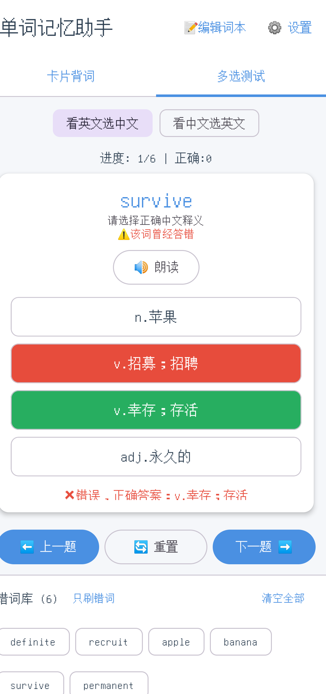

# 单词记忆助手（recite）

一个给自己用的**本地 Android 背单词 App**。词本、错词、学习进度全部存在手机内部存储，
**不联网、无服务端、不需要任何权限**。

界面与交互移植自三个自用的网页原型（卡片浏览 / 多选测试 / 艾宾浩斯日历），本仓库是原生 Android 实现。

<p align="center">
  
  &nbsp;&nbsp;
  
</p>

<p align="center"><sub>左：卡片背词（点击翻面）　右：多选测试（答错时正确项变绿、所选变红）</sub></p>

## 功能

### 卡片背词
- 点击卡片翻面（Y 轴 3D 翻转）
- 「上一个 / 下一个」循环切换，切词时自动朗读
- 错词一键标记与取消，底部错词面板实时联动

### 多选测试
- 两种出题方向：**看英文选中文** / **看中文选英文**
- 四选一，干扰项从**跨全部词本的全局词池**中抽取，且**短语与单词分开抽**
  （不会出现「选单词却混进短语」这种荒谬选项）
- 「看中文选英文」模式下，按词长概率生成**拼写扰动假词**干扰项
  （元音替换 / 后缀替换 / 前缀替换 / 相邻换位），逼你辨析拼写而不是靠释义反推
- 作答后**自动进入下一题**：答对 1.2 秒、答错 2 秒（留出时间看清正确答案）
- 答错自动进错词库；同一题反复答对，正确数只计一次

### 词本与数据
- 多词本：新建 / 切换 / 删除，逐条编辑词条
- **导入词表**：每行一条，分隔符**首选 `%`**（中文输入法下短横极易被打成全角减号或破折号），
  同时兼容 `-` / Tab / 空格；解析失败的行会明确报出行号，不静默丢词
- 错词库：只刷错词 / 清空全部 / 点错词跳回对应题目
- **JSON 备份**导出与导入

## 数据格式与网页版互通

数据结构与网页原型完全一致，**网页版导出的备份 JSON 可以直接导入 App，反之亦然**：

```json
{
  "wordBookList": [
    {
      "bookId": "book_default",
      "bookName": "基础词本",
      "wordItems": [
        { "word": "survive", "cn": "v.幸存；存活" },
        { "word": "permanent", "cn": "adj.永久的" }
      ]
    }
  ],
  "currentBookId": "book_default",
  "wrongWordMap": { "book_default": ["apple"] }
}
```

## 技术栈

| 项 | 选型 |
|---|---|
| 语言 | Kotlin 2.3.20（AGP 9 内置 Kotlin 支持，无需单独应用 kotlin-android 插件） |
| UI | Jetpack Compose（Material 3，Compose BOM 2026.03.01） |
| 构建 | Gradle 9.8.0 + AGP 9.0.1 |
| SDK | compileSdk / targetSdk 36，minSdk 24 |
| 持久化 | 单个 JSON 文件（kotlinx.serialization）—— 数据量在数千词量级，不必上 Room，且文件格式与网页版备份天然一致 |
| 朗读 | 系统 `TextToSpeech`（en-US，语速 0.9） |

## 构建与运行

需要 **JDK 17+** 与 **Android SDK**（platform 36、build-tools 36.0.0）。

```bash
./gradlew assembleDebug        # 产物 → app/build/outputs/apk/debug/app-debug.apk
./gradlew testDebugUnitTest    # 跑单元测试
./gradlew installDebug         # 装到已连接的设备（需开启 USB 调试）
```

## 测试

**45 个 JVM 单元测试**，只覆盖纯逻辑层（`data/` 与 `domain/`，不依赖任何 Android API），
所以 `./gradlew testDebugUnitTest` 不需要模拟器或真机即可全跑：

- 词表解析：`%` / 短横 / Tab / 空格、空行、异常行报告、旧格式兼容
- JSON 往返、文件损坏兜底、与网页版备份互解
- Repository 全部数据操作（词本增删切换、词条增删改、错词同步、备份替换）
- 拼写扰动假词：4 种策略、按词长的概率门限
- 四选一构造：短语与单词分池、选项文本去重、词池过小时的降级
- 计分规则：同一题重复答对不重复计数

> 界面渲染、TTS 发音、系统文件选择器（导出导入备份）属于无法自动验证的部分，靠真机人工验收。

## 目录结构

```
app/src/main/java/com/recite/words/
├── data/     模型 + JSON 持久化 + Repository      ← 纯 Kotlin
├── domain/   词表解析、假词生成、选项构造、计分    ← 纯 Kotlin
├── speech/   TextToSpeech 封装
└── ui/       Compose 界面（两个标签页共用同一份状态）
```

`data/` 与 `domain/` **不 import `android.*`**，因此能被 JVM 单测直接验证；
所有写操作都经过 `ReciteRepository` 单一入口（改一处、存一次）。

## 项目文档

| 文档 | 作用 |
|---|---|
| [`提示词与开发规范.md`](提示词与开发规范.md) | 规则真源：硬约束、命令、工作流程 |
| [`docs/交接文档.md`](docs/交接文档.md) | 现状真源：已实现什么、踩过的坑、待办 |
| [`docs/组件速查表.html`](docs/组件速查表.html) | UI 组件真源：控件编号与规范名 |

## 待办

- [ ] 艾宾浩斯日历复习规划（网页原型里的 `display.html` 部分，尚未移植）
- [ ] adaptive icon（目前是单个矢量图，未做自适应图标）
- [ ] 深色模式配色只做了最小适配

## 作者

**DeepSeek** 😄

> 需求提出、真机验收与长期使用：本仓库作者本人。
